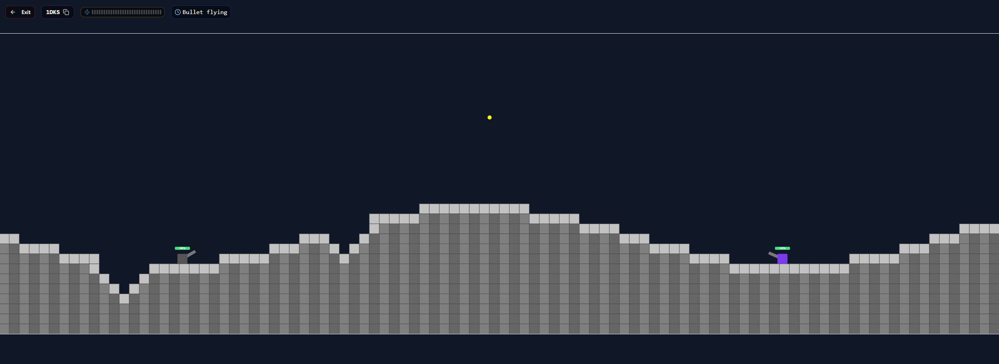
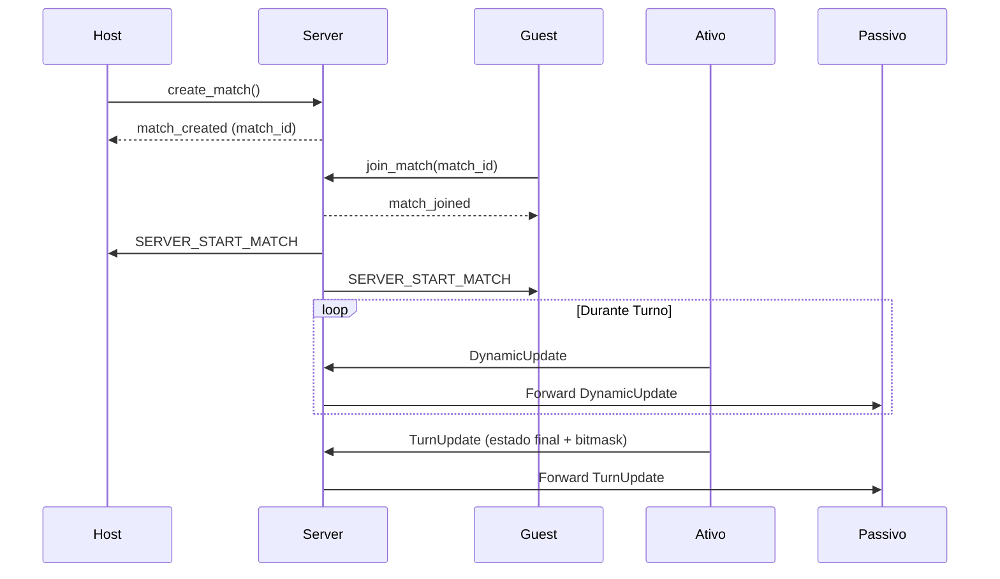
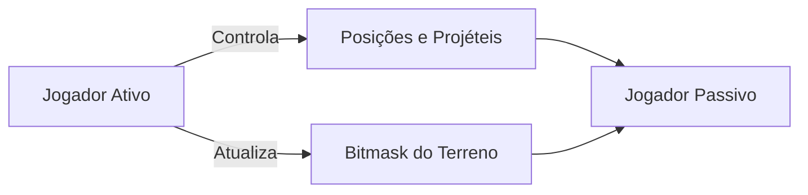

Claro! Abaixo está uma versão aprimorada do seu README, incorporando explicações claras sobre os dois espaços de jogo — **environment space** e **screen space** — e detalhando como o jogo opera sobre o *environment space*. Também foi adicionada uma seção dedicada ao sistema de **terreno destrutível**, explicando como ele é representado e manipulado de forma eficiente usando uma *bitmask* binária.

---

````markdown
# Tankinho: Jogo de Artilharia 2D com Terreno Destrutível

  
*Exemplo de jogo com destruição de terreno e trajetória de projétil.*

---

## 🎯 Visão Geral

**Tankinho** é um jogo 2D por turnos de artilharia, jogado diretamente no navegador. Dois jogadores se enfrentam em combates estratégicos, onde cada tiro pode alterar o terreno, abrir caminhos ou eliminar obstáculos. O jogo é inspirado em clássicos como *Worms* e *ShellShock*, combinando física realista com mapas totalmente destrutíveis.

---

## ✨ Principais Funcionalidades

- ⚔️ **1v1 Online**: Partidas em tempo real contra amigos ou jogadores aleatórios.
- 💣 **Terreno Destrutível**: Modifique o mapa com explosões — cada impacto altera a topografia do jogo.
- 🌪️ **Física de Projéteis**: Com gravidade e vento afetando a trajetória.
- 🔁 **Sistema de Turnos Sincronizados**: Controle confiável e previsível do jogo.
- 🌐 **Jogue de Qualquer Lugar**: Compatível com navegadores desktop e mobile.

---

## 🧭 Espaços de Jogo: Environment vs. Screen Space

O Tankinho trabalha com dois sistemas de coordenadas distintos para renderização e lógica de jogo:

### 🌍 Environment Space
- Representa o **mundo lógico do jogo**, medido em blocos.
- Cada bloco é uma célula em uma matriz fixa (`WIDTH x HEIGHT`).
- Toda a lógica de movimentação, colisão, explosão e alteração de terreno ocorre nesse espaço.
- Exemplo: `(x=25, y=5)` significa a 25ª coluna e 5ª linha do mundo.

### 🖥️ Screen Space
- Representa o **espaço em pixels na tela**, usado para renderizar objetos no canvas.
- Cada bloco do *environment* equivale a `BASE_BLOCK_SIZE` pixels no *screen space*.
- O React-Konva faz a conversão automática entre os dois espaços.

### 🔁 Relação entre os Espaços

```plaintext
screen_x = env_x * BASE_BLOCK_SIZE
screen_y = env_y * BASE_BLOCK_SIZE
````

> Toda simulação acontece em *environment space*; o *screen space* é usado apenas para exibição visual.

---

## 🧨 Terreno Destrutível com Bitmask

Para garantir alta performance e sincronização eficiente, o terreno é representado como uma **máscara de bits** (`bitmask`):

* Cada bit representa uma célula: `1` indica **chão**; `0` indica **ar**.
* O terreno completo é uma matriz comprimida em bytes para transmissão rápida.
* Durante explosões, o jogo recalcula os blocos afetados e envia apenas o *delta* da bitmask.

### Vantagens da Abordagem com Bitmask

* ⚡ **Alta Performance**: Operações bitwise são extremamente rápidas.
* 📦 **Sincronização Eficiente**: Transmissão compacta via `protobuf`.
* 🧮 **Facilidade de Cálculo**: Colisões, explosões e gravidade usam simples verificações binárias.

---

## 🛠 Tecnologias Utilizadas

| Componente   | Tecnologia                |
| ------------ | ------------------------- |
| Frontend     | React + TypeScript        |
| Renderização | React-Konva (Canvas)      |
| Comunicação  | WebSocket + Protobuf      |
| Serialização | Protocol Buffers          |
| Backend      | Python (WebSocket Server) |
| Implantação  | Docker + Nginx            |

---

## 🌐 Arquitetura de Rede

### 🔌 Fluxo de Conexão



---

## ⚙️ Configuração do Cliente (`src/config.ts`)

```ts
enum Environment {
  WIDTH = 100,
  HEIGHT = 30,
  BASE_BLOCK_SIZE = 40
}

export const PLAYER_SPEED = 5;
export const PLAYER_GRAVITY = 9.8;
export const INITIAL_PLAYER_POS = { x: 20, y: 1 };
export const INITIAL_GUEST_POS = { x: 80, y: 1 };

export const SHOOTING_POWER_BARS = 30;
export const BULLET_SPEED_FACTOR = 40;
export const EXPLOSION_RADIUS = 2;
export const EXPLOSION_DAMAGE = 35;

export const TURN_TIME_SEC = 20;
export const DYNAMIC_UPDATE_INTERVAL_MS = 100;
```

---

## 📦 Protocol Buffers

### Exemplo: Estado de Jogo

```proto
message DynamicUpdate {
  Player host_player = 1;
  Player guest_player = 2;
  repeated Bullet bullets = 3;
  Turn turn = 4;
}

message TurnUpdate {
  bytes bit_mask = 1;              // delta do terreno
  DynamicUpdate dynamic_update = 3;
}
```

---

## 🔒 Modelo de Confiança

**O jogador ativo possui autoridade total no seu turno:**



* O jogador inativo apenas replica o estado enviado.
* A simulação local ocorre apenas no turno de quem joga.

---

## 🚀 Implantação

* WebSocket Endpoint: `ws://educautf.td.utfpr.edu.br/tankinho/`

**Infraestrutura:**

* Backend: Python WebSocket server (Docker)
* Proxy: Nginx com suporte a SSL/TLS


