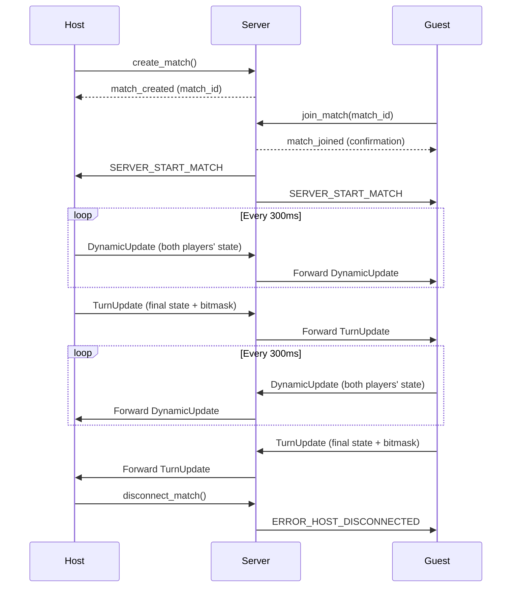
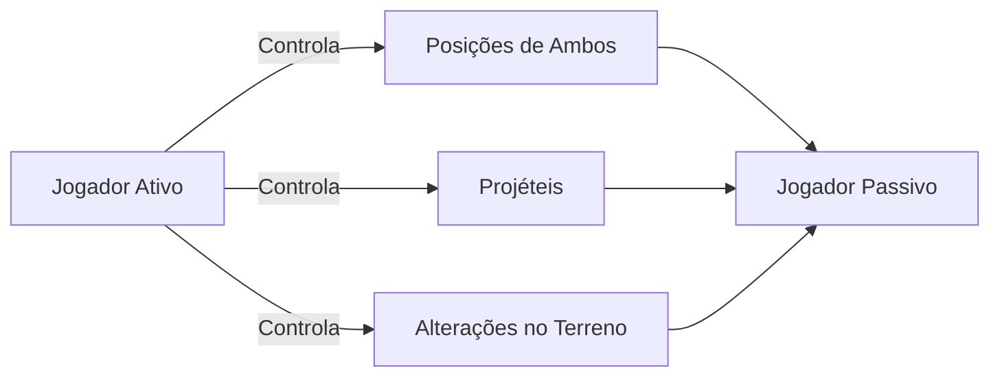

# Tankinho: Jogo de Artilharia 2D com Terreno Destrutível


*Exemplo de jogo com destruição de terreno e trajetória de projétil.*

---

## 🎯 Visão Geral

Tankinho é um duelo de artilharia 2D por turnos, jogado no navegador, com terreno totalmente destrutível. Cada jogador alterna disparos, destruindo obstáculos e modificando o campo de batalha. Inspirado em clássicos como *Worms* e *ShellShock*.

---

## ✨ Principais Funcionalidades

* **1v1 Online**: Enfrente amigos ou oponentes aleatórios.
* **Terreno Dinâmico**: Destruição em tempo real usando sistema de bitmask.
* **Física Realista**: Trajetória de projéteis influenciada por gravidade e vento.
* **Sincronização por Turno**: Modelo de confiança simples que garante jogo fluido.
* **Compatível com Qualquer Navegador**: Acesse de desktop ou dispositivo móvel.

---

## 🛠 Tecnologias Utilizadas

| Componente   | Tecnologia                |
| ------------ | ------------------------- |
| Frontend     | React + TypeScript        |
| Renderização | React-Konva (Canvas)      |
| Comunicação  | WebSocket + Protobuf      |
| Serialização | Protocol Buffers          |
| Backend      | Python (WebSocket Server) |
| Implantação  | Docker + Nginx            |

---

## 🌐 Arquitetura de Rede

### 🔌 Fluxo de Conexão



---

## ⚙️ Configuração do Cliente (`src/config.ts`)

```typescript
// Dimensões do Mundo
enum Environment {
  WIDTH = 100,   // em blocos
  HEIGHT = 30,
  BASE_BLOCK_SIZE = 40 // pixels por bloco (zoom 100%)
}

// Física dos Jogadores
export const PLAYER_SPEED = 5;       // blocos/segundo
export const PLAYER_GRAVITY = 9.8;   // blocos/s²
export const INITIAL_PLAYER_POS = { x: 20, y: 1 };
export const INITIAL_GUEST_POS = { x: 80, y: 1 };

// Sistema de Combate
export const SHOOTING_POWER_BARS = 30;   // níveis de carga
export const BULLET_SPEED_FACTOR = 40;   // conversão em velocidade
export const EXPLOSION_RADIUS = 2;       // raio em blocos
export const EXPLOSION_DAMAGE = 35;      // HP por acerto direto

// Gerenciamento de Turno
export const TURN_TIME_SEC = 20;          // duração do turno (s)
export const DYNAMIC_UPDATE_INTERVAL_MS = 100; // intervalo de sync (ms)
```

---

## 📜 Esquema de Protocol Buffers

### Por que Protobuf?

* **Redução de 87%** no tamanho de payload comparado ao JSON.
* **Geração de código tipado** para TypeScript e Python.
* **Evolução compatível** com versões anteriores.

### Definição do Estado de Jogo (`game.proto`)

```proto
message DynamicUpdate {
  Player host_player = 1;
  Player guest_player = 2;
  repeated Bullet bullets = 3;
  Turn turn = 4;
}

message TurnUpdate {
  bytes bit_mask = 1;        // delta comprimido do terreno
  DynamicUpdate dynamic_update = 3;
}

message Player {
  Vec2 position = 1;
  float aim_angle = 3;
  uint32 health = 4;
}
```

### Mensagens de Conexão (`connection.proto`)

```proto
message ClientMessage {
  oneof message {
    GameUpdate game_update = 1;
    bool create_match = 2;
    string join_match = 3;
  }
}

message ServerMessage {
  oneof message {
    GameUpdate game_update = 1;
    Error error = 2;
    ServerFlags server_flags = 6;
  }
}
```

---

## 🔒 Modelo de Confiança

**Sistema de Autoridade do Jogador Ativo**



* **No Seu Turno**:

  * Controle completo de posições e ângulos de ambos os jogadores.
  * Autoridade sobre projéteis e explosões.
  * Confirmação final das modificações no terreno.

* **Enquanto Aguarda**:

  * Recebe e aplica estado remoto sem validação adicional.
  * Atualiza posições, vida e terreno conforme mensagens recebidas.

---

## 🚀 Implantação

* **Endpoint WebSocket**: `ws://educautf.td.utfpr.edu.br/tankinho/`

**Infraestrutura**:

* Servidor WebSocket em Python (Docker).
* Nginx como proxy reverso (SSL/TLS).
* Auto-scaling (1–3 instâncias).

**Desempenho Médio**:

* Latência: 50 ms (mesma região).
* \~150 partidas simultâneas por instância.
* Banda: 15 KB/s por partida.
