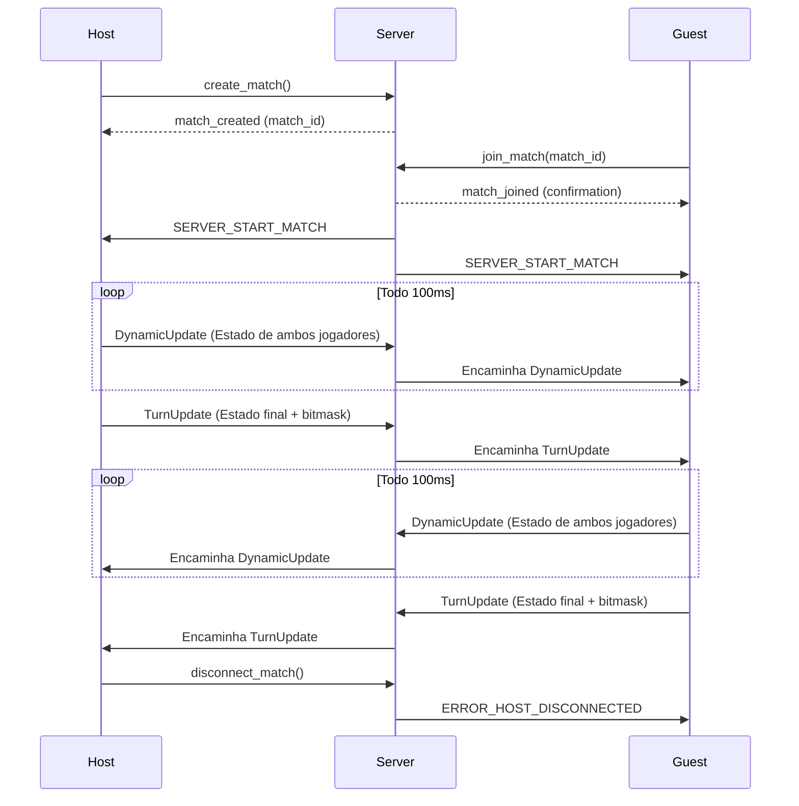
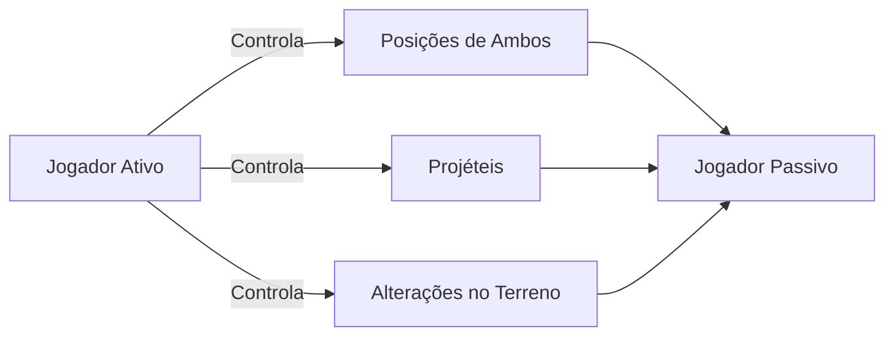

# Tankinho: Jogo de Artilharia 2D com Terreno Destrutível


*Exemplo de jogo com destruição de terreno e trajetória de projétil.*

---

## 🎯 Visão Geral

Tankinho é um duelo de artilharia 2D por turnos, jogado no navegador, com terreno totalmente destrutível. Cada jogador alterna disparos, destruindo obstáculos e modificando o campo de batalha. Inspirado em clássicos como *Worms* e *ShellShock*.

---

## ✨ Principais Funcionalidades

* **1v1 Online**: Enfrente amigos ou oponentes aleatórios.
* **Terreno Dinâmico**: Destruição em tempo real usando sistema de bitmask.
* **Física Realista**: Trajetória de projéteis influenciada por gravidade e vento.
* **Sincronização por Turno**: Modelo de confiança simples que garante jogo fluido.
* **Compatível com Qualquer Navegador**: Acesse de desktop ou dispositivo móvel.

---

## 🛠 Tecnologias Utilizadas

| Componente   | Tecnologia                |
| ------------ | ------------------------- |
| Frontend     | React + TypeScript        |
| Renderização | React-Konva (Canvas)      |
| Comunicação  | WebSocket + Protobuf      |
| Serialização | Protocol Buffers          |
| Backend      | Python (WebSocket Server) |
| Implantação  | Docker + Nginx            |

---
### 🌍 Environment Space
- Representa o **mundo lógico do jogo**, medido em blocos.
- Cada bloco é uma célula em uma matriz fixa (`WIDTH x HEIGHT`).
- Toda a lógica de movimentação, colisão, explosão e alteração de terreno ocorre nesse espaço.
- Exemplo: `(x=25, y=5)` significa a 25ª coluna e 5ª linha do mundo.

### 🖥️ Screen Space
- Representa o **espaço em pixels na tela**, usado para renderizar objetos no canvas.
- Cada bloco do *environment* equivale a `BASE_BLOCK_SIZE` pixels no *screen space*.
- O React-Konva faz a conversão automática entre os dois espaços.

### 🔁 Relação entre os Espaços

```plaintext
screen_x = env_x * BASE_BLOCK_SIZE
screen_y = env_y * BASE_BLOCK_SIZE
````

> Toda simulação acontece em *environment space*; o *screen space* é usado apenas para exibição visual.

---

## 🧨 Terreno Destrutível com Bitmask

Para garantir alta performance e sincronização eficiente, o terreno é representado como uma **máscara de bits** (`bitmask`):

* Cada bit representa uma célula: `1` indica **chão**; `0` indica **ar**.
* O terreno completo é uma matriz comprimida em bytes para transmissão rápida.
* Durante explosões, o jogo recalcula os blocos afetados e envia apenas o *delta* da bitmask.

### Vantagens da Abordagem com Bitmask

* ⚡ **Alta Performance**: Operações bitwise são extremamente rápidas.
* 📦 **Sincronização Eficiente**: Transmissão compacta via `protobuf`.
* 🧮 **Facilidade de Cálculo**: Colisões, explosões e gravidade usam simples verificações binárias.

---

## 🌐 Arquitetura de Rede

### 🔌 Fluxo de Conexão



---

## ⚙️ Configuração do Cliente (`src/config.ts`)

```typescript
// Dimensões do Mundo
enum Environment {
  WIDTH = 100,   // em blocos
  HEIGHT = 30,
  BASE_BLOCK_SIZE = 40 // pixels por bloco (zoom 100%)
}

// Física dos Jogadores
export const PLAYER_SPEED = 5;       // blocos/segundo
export const PLAYER_GRAVITY = 9.8;   // blocos/s²
export const INITIAL_PLAYER_POS = { x: 20, y: 1 };
export const INITIAL_GUEST_POS = { x: 80, y: 1 };

// Sistema de Combate
export const SHOOTING_POWER_BARS = 30;   // níveis de carga
export const BULLET_SPEED_FACTOR = 40;   // conversão em velocidade
export const EXPLOSION_RADIUS = 2;       // raio em blocos
export const EXPLOSION_DAMAGE = 35;      // HP por acerto direto

// Gerenciamento de Turno
export const TURN_TIME_SEC = 20;          // duração do turno (s)
export const DYNAMIC_UPDATE_INTERVAL_MS = 100; // intervalo de sync (ms)
```

---

## 📜 Esquema de Protocol Buffers

### Por que Protobuf?

* **Redução de 87%** no tamanho de payload comparado ao JSON.
* **Geração de código tipado** para TypeScript e Python.
* **Evolução compatível** com versões anteriores.

### Definição do Estado de Jogo (`game.proto`)

```proto
syntax = "proto3";

enum Turn {
  TURN_HOST = 0;
  TURN_GUEST = 1;
}

message Vec2 {
  float x = 1;
  float y = 2;
}

message Bullet {
  Vec2 position = 1;
  Vec2 velocity = 2;
}

message Player {
  Vec2 position = 1;
  Vec2 velocity = 2;
  float aim_angle = 3;
  uint32 health = 4;
  uint32 time_left = 5;
}

message DynamicUpdate {
  Player host_player = 1;
  Player guest_player = 2;

  repeated Bullet bullets = 3;
  Turn turn = 4;
}

message TurnUpdate {
  bytes bit_mask = 1;
  DynamicUpdate dynamic_update = 3;
}

message GameUpdate {
  string match_id = 1;
  oneof data {
    DynamicUpdate dynamic_update = 2;
    TurnUpdate turn_update = 3;
  }
}
```

### Mensagens de Conexão (`connection.proto`)

```proto
syntax = "proto3";

import "game.proto";

message ClientMessage {
  enum ClientFlags {
    NONE = 0;
  }
  
  oneof message {
    GameUpdate game_update = 1;
    bool create_match = 2;
    string join_match = 3;
    ClientFlags client_flags = 4;
    string disconnect_match = 5; // match id
  }
}

message ServerMessage {
  message MatchCreationOrJoin {
    string match_id = 1;
    uint32 player_id = 2;
  }

  enum ServerFlags {
    SERVER_START_MATCH = 0;
  }

  oneof message {
    GameUpdate game_update = 1;
    Error error = 2;
    bool success = 3;
    MatchCreationOrJoin match_created = 4;
    MatchCreationOrJoin match_joined = 5;
    ServerFlags server_flags = 6;
  }
}

message Error {
    string message = 1;
    Type type = 2;    

    enum Type {
        ERROR_NONE = 0;
        ERROR_MATCH_NOT_FOUND = 1;
        ERROR_MATCH_FULL = 2;
        ERROR_UNKNOWN = 3;
        ERROR_HOST_DISCONNECTED = 4;
        ERROR_GUEST_DISCONNECTED = 5;
    }
}
```

---

## 🔒 Modelo de Confiança

**Sistema de Autoridade do Jogador Ativo**



* **No Seu Turno**:

  * Controle completo de posições e ângulos de ambos os jogadores.
  * Autoridade sobre projéteis e explosões.
  * Confirmação final das modificações no terreno.

* **Enquanto Aguarda**:

  * Recebe e aplica estado remoto sem validação adicional.
  * Atualiza posições, vida e terreno conforme mensagens recebidas.

---

## 🚀 Implantação

* **Endpoint WebSocket**: `ws://educautf.td.utfpr.edu.br/tankinho/`

**Infraestrutura**:

* Servidor WebSocket em Python (Docker).
* Nginx como proxy reverso (SSL/TLS).
